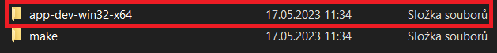
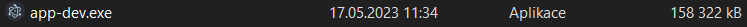
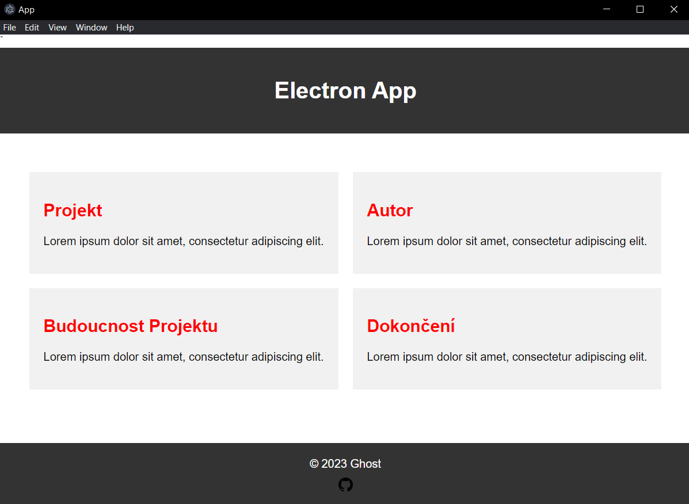

># Basics for creating a window in electron.
>> ## Before we start, you should have already installed Node.js.
***
>## Creating a workspace:

***
```bash
mkdir my-electron-app
cd my-electron-app
npm init
```
***

>## After creating a package.json, you should always been in the root folder of your app or you will get errors - always use ```cd``` comand to access the folder

***
```bash
npm install --save-dev electron
```
***

>## Then adding a start command to the package.json in "scripts": {}:

***
```json
"start": "electron ."
```
***

>## Than:

***
```bash
npm start
```
***

>## Package.json should look like this:

***
```json
{
  "name": "app-name",
  "version": "1.0.0",
  "description": "your-description",
  "main": "main.js",
  "scripts": {
    "start": "electron ."
  },
  "author": "name",
  "license": "MIT",
  "devDependencies": {
    "electron": "^24.3.0"
  }
}
```
***

>## Running the main project:

***
- Creating a JS file main.js where will create the window later.
- Creating a HTML file index.html frome where we will display the content to the app.
- Just create basic HTML document and fill with some text.

***
```html
<body>
    <h1>Hello World!</h1> <!-- Just an example-->
  </body>
```
***

>## Now in the main.js we create the window:
> Import these common modules at the top of the file.

***
```js
const { app, BrowserWindow } = require('electron')
```
***

> Than we will add a function loading index.html into a new BrowserWindow instance

***
```js
const createWindow = () => {
  const win = new BrowserWindow({
    width: 800,
    height: 600
  })

  win.loadFile('index.html')
}
```
***

> In Electron, browser windows can only be created after the app module's ready event is fired. You can wait for this event by using the app.whenReady() API. Call createWindow() after whenReady() resolves its Promise:

***
```js
app.whenReady().then(() => {
  createWindow()
})
```
***

>## Managing window's livecycle. Quit the app when all windows are closed (Windows & Linux)

***
```js
app.on('window-all-closed', () => {
  if (process.platform !== 'darwin') app.quit()
})
```
***

> Open a window if none are open (macOS)

***
```js
app.whenReady().then(() => {
  createWindow()

  app.on('activate', () => {
    if (BrowserWindow.getAllWindows().length === 0) createWindow()
  })
})
```
***

>## This code accesses the Node.js process.versions object and runs a basic replaceText helper function to insert the version numbers into the HTML document. You have to creane new JS file - preload.js

***
```js
window.addEventListener('DOMContentLoaded', () => {
  const replaceText = (selector, text) => {
    const element = document.getElementById(selector)
    if (element) element.innerText = text
  }

  for (const dependency of ['chrome', 'node', 'electron']) {
    replaceText(`${dependency}-version`, process.versions[dependency])
  }
})
```
***

>## To attach this script to your renderer process, pass in the path to your preload script to the webPreferences.preload option in your existing BrowserWindow constructor.

***
```js
const path = require('path')

const createWindow = () => {
  const win = new BrowserWindow({
    width: 800,
    height: 600,
    webPreferences: {
      preload: path.join(__dirname, 'preload.js')
    }
  })

  win.loadFile('index.html')
}
```
***

>## You can also add functionality to your web contents by adding script tag to end of the body tag in HTML file.

***
```js
<script src="./renderer.js"></script>
```
***

> The code contained in renderer.js can then use the same JavaScript APIs and tooling you use for typical front-end development, such as using webpack to bundle and minify your code or React to manage your user interfaces.

># Package and Distribute the application after its done.
>>## Fastest way to do that is using Electron Forge.
***

> Add Electron Forge as a development dependency of your app, and use its import command to set up Forge's scaffolding:

***
```bash
npm install --save-dev @electron-forge/cli
```
***

***
```bash
npx electron-forge import
```
***

> Creating a distributable

***
```bash
npm run make
```
***

>## Electron Forge will create the out folder where your package will be located.

***

***

***

***

>## After designing the whole app and creating the distribution.
>
***

***


