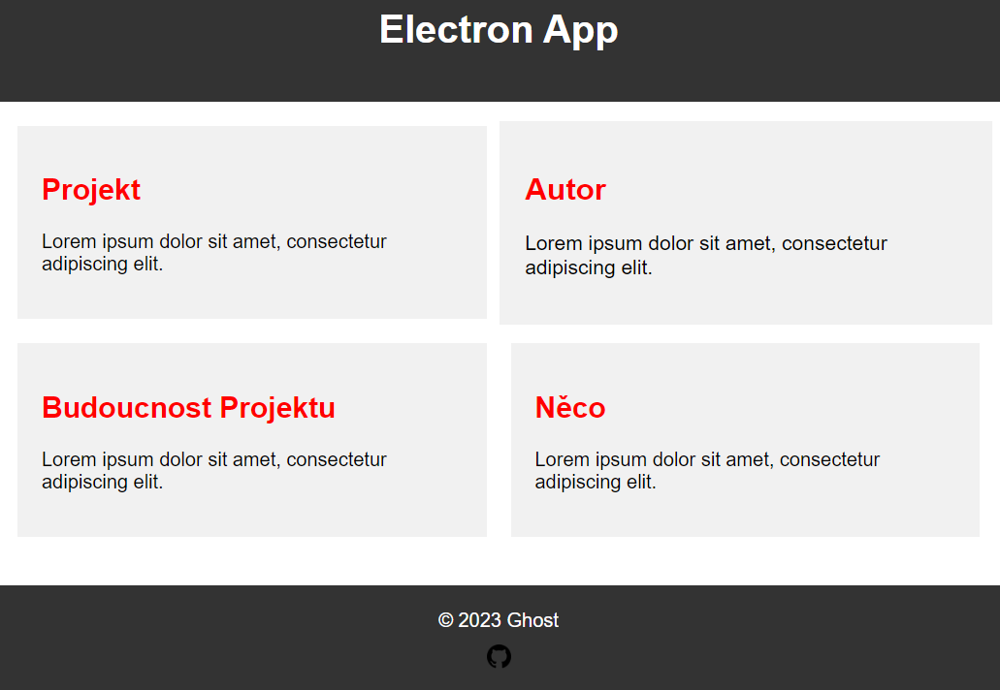
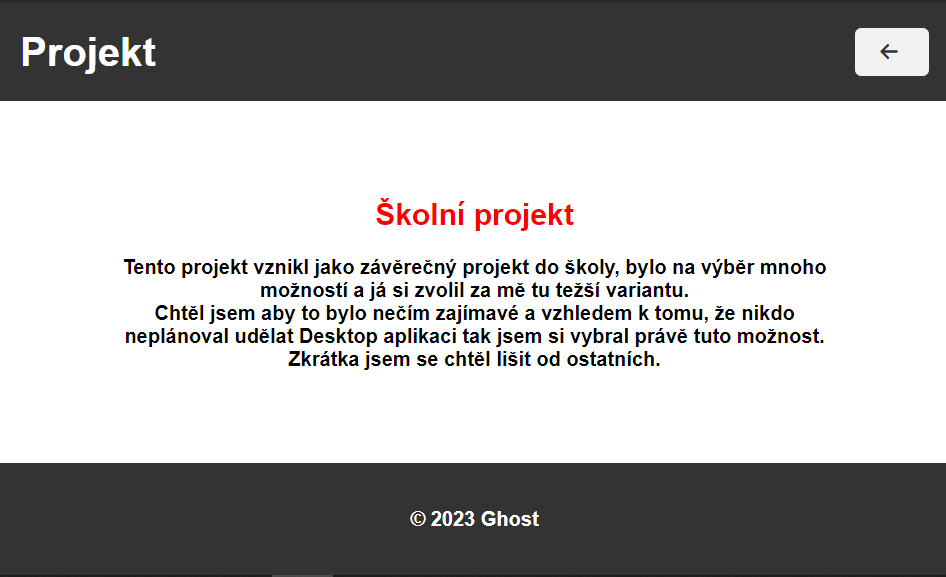
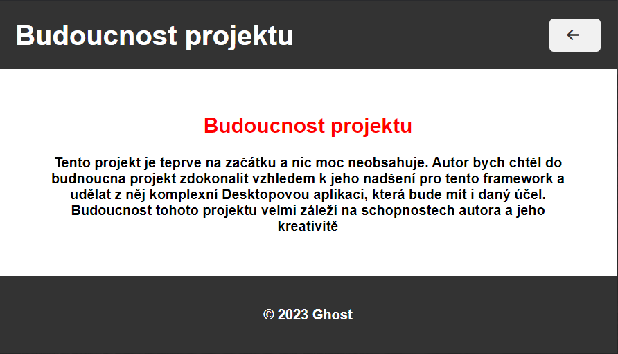
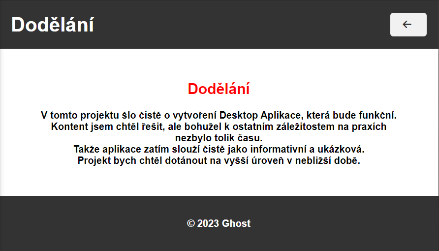

> # Basic informations about the app design.
>> ## The whole app is designed to be simple and responsive.
>> ## Used technology (HTML, CSS, JS, ELECTRON, NODE)
***
> ## The Main Page
***
>> - The header only contains a h1 text.
>> - It is designed to be simple
>> - It contains 4 cards, all of them are linking to their own pages.
>> - They also animated using the hover in CSS.
>> The footer is also animated with hover and it contains github link with copyright.
***
> 
***

> ## The Project Page
***
>> - It contains the h2 with a title text and a paragraph with the text.
>> - The text is animated with the fadeInDown and fadeInUp
***
> 
***

> ## The Author Page
***
>> - The page is only about author of the application. Who is he, what's he doing which technology he's using.
>> - The text is animated with the fadeInDown and fadeInUp
***
> 
***

> ## The Future Page
***
>> - The page is about the future of the application and wo the author is planning to do with this project.
>> - The text is animated with the fadeInDown and fadeInUp.
***
> 

> ## The Finish Page
***
>> - This page contains the purpose why is it simple like that and that the author want's to finish this on higher level.
***
> 
***
